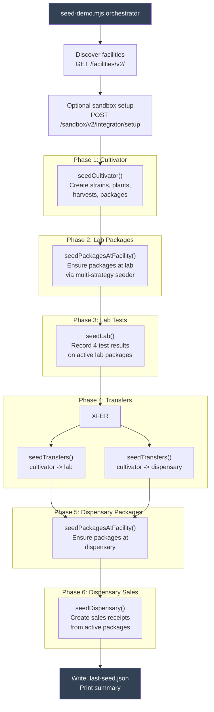
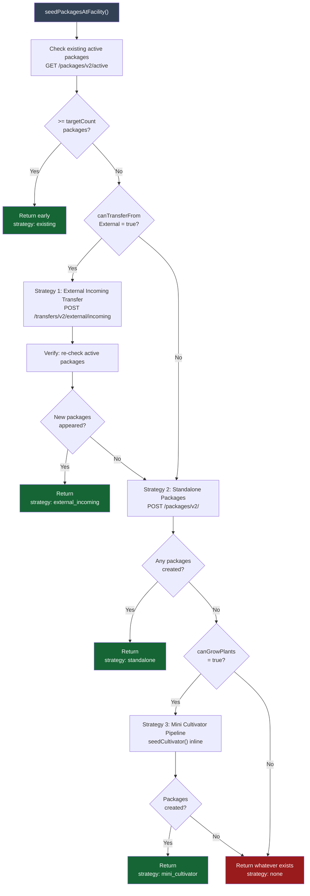
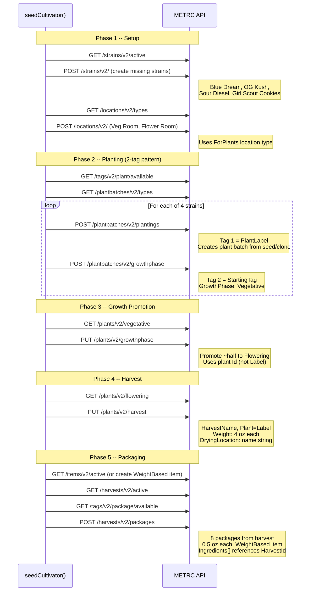

# Sandbox Seeding Pipeline

Comprehensive technical reference for the `seed-demo.mjs` orchestrator and its seeders. Documents the pipeline architecture, the multi-strategy package seeder, per-state results, and the confirmed METRC API limitations that shape what is possible.

Last verified: 2026-02-23. API limitations confirmed by Metrc support case #02372700 and direct API probing.

For facility selection guidance and API rules, see [Sandbox Limitations & Facility Selection](./sandbox-limitations).

---

## 1. Seeding Pipeline Architecture

The orchestrator (`scripts/seed-demo.mjs`) runs seeders in strict dependency order. Each seeder depends on the output of the previous step.



Each phase is wrapped in a try/catch. A failure in one phase does not abort subsequent phases -- the orchestrator logs the error and continues. The final summary reports which phases succeeded and which failed.

---

## 2. Per-Facility Package Seeder Strategy

The package seeder (`scripts/seeders/package-seeder.mjs`) is invoked before both the lab and dispensary phases. It uses a waterfall of strategies to get active packages at a target facility.



### Strategy Details

**Strategy 1: External Incoming Transfer** requires `CanTransferFromExternalFacilities=true`. Creates a transfer manifest from a "shipper" facility. The payload uses the `Destinations[]` wrapper format with full shipper address and transporter/driver details. Packages are assigned tags from the receiving facility's available pool. However, packages remain in "pending receipt" -- there is no METRC API to accept/receive them. This strategy creates visible transfer activity but does NOT produce active packages.

**Strategy 2: Standalone Package Creation** attempts `POST /packages/v2/` directly. Requires `CanCreateOpeningBalancePackages=true` on the facility. If the first package fails, the seeder aborts this strategy immediately (likely a permissions issue rather than transient error).

**Strategy 3: Mini Cultivator Pipeline** requires `CanGrowPlants=true`. Imports and runs the full `seedCultivator()` function at the target facility: strains, locations, plant batches, vegetative/flowering growth phases, harvest, then package creation from harvest. This is the only reliable way to create active packages at facilities that lack opening balance permissions.

---

## 3. State-by-State Results Matrix

What actually works when you run `npm run seed:demo` as of February 2026.

### Colorado

| Facility | License | Seeder | Result | Detail |
|----------|---------|--------|--------|--------|
| Cultivator (CO-21) | `SF-SBX-CO-21-8002` | `seedCultivator()` | WORKS | Full pipeline: 4 strains, 4 plant batches (2-tag pattern), ~2 flowering, 1 harvest, 8 packages from harvest |
| Lab (CO-25) | `SF-SBX-CO-25-8002` | `seedPackagesAtFacility()` | PARTIAL | Strategy 1 (external incoming) creates transfer manifests with IDs, but packages stay in "pending receipt". Strategy 2 fails (no opening balance). Strategy 3 fails (no CanGrowPlants). Net result: 0 active packages |
| Lab (CO-25) | `SF-SBX-CO-25-8002` | `seedLab()` | BLOCKED | No active packages at lab -- lab test recording cannot proceed |
| Transfers | CO-21 -> CO-25 | `seedTransfers()` | WORKS | Outgoing transfer templates created successfully with driver info |
| Transfers | CO-21 -> CO-24 | `seedTransfers()` | WORKS | Outgoing transfer templates created successfully |
| Dispensary (CO-24) | `SF-SBX-CO-24-8002` | `seedPackagesAtFacility()` | FAILS | All three strategies fail. No CanTransferFromExternalFacilities, no CanCreateOpeningBalancePackages, no CanGrowPlants |
| Dispensary (CO-24) | `SF-SBX-CO-24-8002` | `seedDispensary()` | BLOCKED | No active packages -- sales cannot be created |

### Massachusetts

| Facility | License | Seeder | Result | Detail |
|----------|---------|--------|--------|--------|
| Cultivator (MA-4) | `SF-SBX-MA-4-3301` | `seedCultivator()` | WORKS | Full pipeline: 4 strains, 4 plant batches (2-tag pattern), ~2 flowering, 1 harvest, 8 packages from harvest |
| Lab (MA-8) | `SF-SBX-MA-8-3301` | `seedPackagesAtFacility()` | WORKS | Strategy 3 (mini-cultivator) succeeds because MA-8 has both CanGrowPlants AND CanTestPackages. Creates 8 local packages |
| Lab (MA-8) | `SF-SBX-MA-8-3301` | `seedLab()` | WORKS | Records 4 lab test results: 2 pass (pass-clean, pass-highcbd), 2 fail (fail-metals, fail-micro). Dynamic test type discovery maps to MA-style "Raw Plant Material" names |
| Transfers | MA-4 -> MA-8 | `seedTransfers()` | PARTIAL | Transfer templates may fail with "NotSubmitted" error -- MA packages start in NotSubmitted state. Seeder retries with older packages |
| Transfers | MA-4 -> MA-9 | `seedTransfers()` | PARTIAL | Same NotSubmitted issue. State-specific regulation: no API to submit/approve packages |
| Dispensary (MA-9) | `SF-SBX-MA-9-3301` | `seedPackagesAtFacility()` | FAILS | All three strategies fail. Same as CO dispensary -- no path to active packages |
| Dispensary (MA-9) | `SF-SBX-MA-9-3301` | `seedDispensary()` | BLOCKED | No active packages -- sales cannot be created |

### Summary

```
CO:  Cultivator WORKS  |  Lab BLOCKED  |  Transfers WORKS  |  Dispensary BLOCKED
MA:  Cultivator WORKS  |  Lab WORKS    |  Transfers PARTIAL |  Dispensary BLOCKED
```

---

## 4. Confirmed API Limitations

As of February 2026. Confirmed via Metrc support case #02372700 and direct API endpoint probing.

### No receive/accept API for incoming transfers

External incoming transfers (`POST /transfers/v2/external/incoming`) create transfer manifests. The manifest gets an ID and shows up in incoming transfer lists. However, the packages within the transfer stay in "pending receipt" status and never appear in the receiving facility's active package inventory.

Probed endpoint variations that all returned HTTP 404:
- `POST /transfers/v2/incoming/{id}/receive`
- `PUT /transfers/v2/incoming/{id}/receive`
- `POST /transfers/v2/{id}/receive`
- `POST /transfers/v2/incoming/receive`
- `PUT /transfers/v2/incoming/{id}`
- `POST /transfers/v2/incoming/{id}/packages/receive`
- `POST /transfers/v2/receive`
- `PUT /transfers/v2/packages/receive`
- `POST /packages/v2/receive`
- `PUT /packages/v2/receive`

This is not a sandbox limitation -- it is expected production API behavior. Transfer acceptance happens through the METRC web UI, not the API.

### Standalone packages require CanCreateOpeningBalancePackages

`POST /packages/v2/` for creating packages without a source harvest is gated by the `CanCreateOpeningBalancePackages` facility type flag. Colorado sandbox Retail facilities (CO-21, CO-24, CO-25) all have this flag set to `false`. This is not a sandbox bug.

### Lab tests require CanTestPackages=true

`POST /labtests/v2/record` returns HTTP 401 on any facility where `CanTestPackages` is `false`. Only Testing Lab / Research facility types have this flag. Confirmed: running the lab seeder on a cultivator facility will always fail.

### MA packages start in NotSubmitted state

Packages created at Massachusetts facilities have a `SubmittedDate: null` / `SubmittedDateTime: null` property. These packages cannot be included in transfer templates -- the API returns a "NotSubmitted" error. There is no API endpoint to submit or approve packages. This is a Massachusetts-specific regulatory requirement enforced at the API level.

The transfer seeder handles this by:
1. Filtering out NotSubmitted packages before attempting transfer creation
2. Falling back to all packages if the `SubmittedDate` field does not exist (CO behavior)
3. Retrying with older packages that may have been auto-submitted over time

### External incoming transfers require Destinations[] wrapper

The `POST /transfers/v2/external/incoming` endpoint requires the nested `Destinations[]` format, not a flat payload. The shipper fields are top-level, and packages are nested inside `Destinations[].Packages[]`. See Section 6 for the full payload format.

---

## 5. Facility Capability Matrix

Capabilities as discovered by `npm run seed:probe` via `GET /facilities/v2/`. These flags determine which seeder strategies are available at each facility.

| Facility | License | CanGrowPlants | CanTestPackages | CanTransferFromExternal | CanCreateOpeningBalance | CanSellToConsumers |
|----------|---------|:---:|:---:|:---:|:---:|:---:|
| CO-21 Retail Cultivation | `SF-SBX-CO-21-8002` | true | false | false | false | false |
| CO-22 Retail Manufacturer | `SF-SBX-CO-22-8002` | false | false | false | false | false |
| CO-24 Retail Store | `SF-SBX-CO-24-8002` | false | false | false | false | true |
| CO-25 Retail Testing Lab | `SF-SBX-CO-25-8002` | false | true | true | false | false |
| MA-4 Cultivator | `SF-SBX-MA-4-3301` | true | false | false | false | false |
| MA-8 Research | `SF-SBX-MA-8-3301` | true | true | false | false | false |
| MA-9 Retailer | `SF-SBX-MA-9-3301` | false | false | false | false | true |

Key observations:

- **MA-8 is the only facility with both CanGrowPlants AND CanTestPackages.** This is why MA lab seeding works (mini-cultivator creates packages locally, then lab seeder tests them) while CO lab seeding is blocked.
- **No dispensary facility has CanGrowPlants or CanCreateOpeningBalancePackages.** There is no programmatic path to create active packages at a dispensary. Sales seeding is blocked for both states.
- **CO-25 has CanTransferFromExternalFacilities** but not CanGrowPlants. External incoming creates manifests but packages cannot be received (no accept API). Dead end.

---

## 6. External Incoming Transfer Payload

The correct payload format for `POST /transfers/v2/external/incoming`, discovered through iterative probing in February 2026. This is what `package-seeder.mjs` Strategy 1 sends.

```json
[
  {
    "ShipperFacilityLicenseNumber": "SF-SBX-CO-21-8002",
    "ShipperFacilityName": "Seed Source Facility",
    "ShipperName": "Seed Source Facility",
    "ShipperAddress1": "123 Cannabis Way",
    "ShipperAddress2": "",
    "ShipperAddressCity": "Denver",
    "ShipperAddressState": "Colorado",
    "ShipperAddressPostalCode": "80202",
    "TransferTypeName": "Affiliated Transfer",
    "Destinations": [
      {
        "RecipientLicenseNumber": "SF-SBX-CO-25-8002",
        "TransferTypeName": "Affiliated Transfer",
        "PlannedRoute": "Direct Route",
        "EstimatedDepartureDateTime": "2026-02-23T06:00:00.000Z",
        "EstimatedArrivalDateTime": "2026-02-23T07:30:00.000Z",
        "Transporters": [
          {
            "TransporterFacilityLicenseNumber": "SF-SBX-CO-21-8002",
            "TransporterDirection": "Outbound",
            "EstimatedDepartureDateTime": "2026-02-23T06:00:00.000Z",
            "EstimatedArrivalDateTime": "2026-02-23T07:30:00.000Z",
            "DriverName": "Seed Driver",
            "DriverLicenseNumber": "DL-000000",
            "DriverOccupationalLicenseNumber": "",
            "VehicleMake": "Ford",
            "VehicleModel": "Transit",
            "VehicleLicensePlateNumber": "SEED-XYZ"
          }
        ],
        "Packages": [
          {
            "PackageLabel": "1A4050000000000000000001",
            "ItemName": "Seed Flower dxxxxxx",
            "Quantity": 1.0,
            "UnitOfMeasureName": "Ounces",
            "PackagedDate": "2026-02-23",
            "WholesalePrice": 100.00,
            "GrossWeight": 28.0,
            "GrossUnitOfWeightName": "Grams"
          }
        ]
      }
    ]
  }
]
```

Required fields (validated by the API -- omitting any causes HTTP 400):

- **Top level**: `ShipperFacilityLicenseNumber`, `ShipperFacilityName`, `ShipperName`, `ShipperAddress1`, `ShipperAddressCity`, `ShipperAddressState`, `ShipperAddressPostalCode`, `TransferTypeName`
- **Destinations[]**: `RecipientLicenseNumber`, `TransferTypeName`, `PlannedRoute`, `EstimatedDepartureDateTime`, `EstimatedArrivalDateTime`
- **Destinations[].Transporters[]**: `TransporterFacilityLicenseNumber`, `DriverName`, `DriverLicenseNumber`, `VehicleMake`, `VehicleModel`, `VehicleLicensePlateNumber`
- **Destinations[].Packages[]**: `PackageLabel`, `ItemName`, `Quantity`, `UnitOfMeasureName`, `PackagedDate`

The `TransferTypeName` is discovered dynamically via `GET /transfers/v2/types`. The seeder prefers types with `ForExternalIncomingShipments=true`, then falls back to "Affiliated Transfer" or "Unaffiliated Transfer".

---

## 7. Cultivator Pipeline

The cultivator seeder (`scripts/seeders/cultivator.mjs`) implements the full METRC plant lifecycle. This is also reused by the package seeder's Strategy 3 (mini-cultivator).



### The 2-Tag Pattern

Each plant requires two METRC tags:

1. **Tag 1 (PlantLabel)** -- Used in `POST /plantbatches/v2/plantings` to create the initial plant batch. This tag identifies the batch.
2. **Tag 2 (StartingTag)** -- Used in `POST /plantbatches/v2/growthphase` to convert the batch to a tracked Vegetative plant. This becomes the individual plant's tracking tag.

The seeder calculates `COUNT = min(4, strains.length, floor(availableTags / 2))` to ensure it never runs out of tags mid-batch.

### Fallback: Standalone Packages

If harvest packaging fails (no active harvests or insufficient tags), the cultivator seeder falls back to creating standalone packages via `POST /packages/v2/`. This only works at facilities with `CanCreateOpeningBalancePackages=true`.

---

## 8. Script Reference

All commands run from the `metrc-mcp/` project root.

| Command | Script | Description |
|---------|--------|-------------|
| `npm run seed:demo` | `scripts/seed-demo.mjs` | Run the full seeding pipeline for both CO and MA. Recommended entry point. |
| `npm run seed:co` | `scripts/seed-demo.mjs --state CO` | Seed Colorado facilities only. |
| `npm run seed:ma` | `scripts/seed-demo.mjs --state MA` | Seed Massachusetts facilities only. |
| `npm run seed:probe` | `scripts/probe-facilities.mjs` | Probe all sandbox facilities and output capability flags as JSON. Use this to verify facility capabilities before seeding. |
| `npm run populate-sandbox` | `scripts/populate-sandbox.mjs` | Legacy script. Seeds CO-21 with basic cultivation data. Predates the orchestrator; use `seed:demo` instead. |

### Environment Variables

| Variable | Required | Description |
|----------|----------|-------------|
| `METRC_VENDOR_API_KEY` | Yes (CO) | Colorado sandbox vendor API key |
| `METRC_USER_API_KEY` | Yes (CO) | Colorado sandbox user API key |

Massachusetts sandbox credentials are hardcoded in the state config (public sandbox keys).

### Output

Each run writes metadata to `scripts/.last-seed.json`:

```json
{
  "runId": "dxxxxxx",
  "timestamp": "2026-02-23T00:00:00.000Z",
  "statesSeeded": ["CO", "MA"],
  "elapsedSeconds": 45.2,
  "results": [
    {
      "state": "CO",
      "facilities": [...],
      "seeders": {
        "cultivator": { "strainsTotal": 4, "plantsPlanted": 4, "packagesCreated": 8 },
        "labPackages": { "packagesFound": 0, "strategy": "none" },
        "lab": { "tested": 0, "passed": 0, "failed": 0, "skipped": 0 },
        "transfersToLab": { "transferred": 4, "skipped": 0 },
        "transfers": { "transferred": 4, "skipped": 0 },
        "dispensaryPackages": { "packagesFound": 0, "strategy": "none" },
        "dispensary": { "receiptsCreated": 0, "skipped": 0 }
      }
    }
  ]
}
```

### Run ID Format

The run ID is `d` + `Date.now().toString(36)` (e.g., `dm3xyz5k`). It is used as a suffix in entity names (`demo-dm3xyz5k-Blue-Dream-0`) to avoid collisions across multiple seeding runs. The `d` prefix stands for "demo".

---

## 9. Seeder File Map

| File | Purpose | Exports |
|------|---------|---------|
| `scripts/seed-demo.mjs` | Orchestrator. Parses CLI args, loads env, runs seeders in order, writes metadata. | `main()` (self-executing) |
| `scripts/seeders/cultivator.mjs` | Full plant lifecycle: strains, locations, plantings, growth phases, harvest, packages. | `seedCultivator(api, license, runId)` |
| `scripts/seeders/package-seeder.mjs` | Multi-strategy package creation for non-cultivator facilities. | `seedPackagesAtFacility(api, license, runId, options)` |
| `scripts/seeders/lab.mjs` | Lab test recording with 4 test profiles and dynamic type discovery. | `seedLab(api, license, runId, options)` |
| `scripts/seeders/transfer.mjs` | Outgoing transfer template creation between facilities. | `seedTransfers(api, fromLicense, toLicense, runId)` |
| `scripts/seeders/dispensary.mjs` | Sales receipt creation using active packages. | `seedDispensary(api, license, runId)` |
| `scripts/lib/metrc-fetch.mjs` | HTTP client factory with HMAC auth, rate limiting, and state config. | `createMetrcFetch(config)`, `loadEnvFile(path)`, `getStateConfig()` |

---

## 10. Lab Test Profiles

The lab seeder creates 4 test profiles that are applied in rotation across available packages:

| Profile | Overall Result | Key Analytes | Purpose |
|---------|---------------|--------------|---------|
| `pass-clean` | PASS | THC 22.5%, CBD 0.8%, all contaminants below limits | Standard passing flower |
| `pass-highcbd` | PASS | THC 5.2%, CBD 14.8%, clean contaminants | High-CBD variety |
| `fail-metals` | FAIL | THC 18.3%, Arsenic 2.5ppm, Cadmium 1.8ppm, Lead 3.2ppm | Heavy metal contamination |
| `fail-micro` | FAIL | THC 25.1%, Yeast 50000 CFU/g, E.coli 150 CFU/g, Salmonella detected | Microbial contamination |

Test type names are discovered dynamically via `GET /labtests/v2/types` and matched by keyword (e.g., "total thc" matches "Total THC (%) Raw Plant Material"). The seeder prefers "Raw Plant Material" variants. If discovery fails, it falls back to hardcoded MA-style names.
